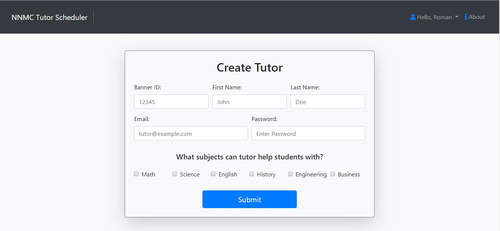

# Tutor-Scheduler Web App

## Has three different logins. Students, tutors, and admins.

## Students choose subject and tutor 

## Then schedule session according to tutors available schedule

## Tutoring session confirmation page 

## Students account shows all scheduled sessions

## Admin account can create and delete tutors from database

## Admin can also set and delete tutor's available times

